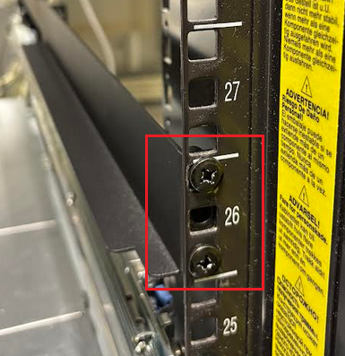
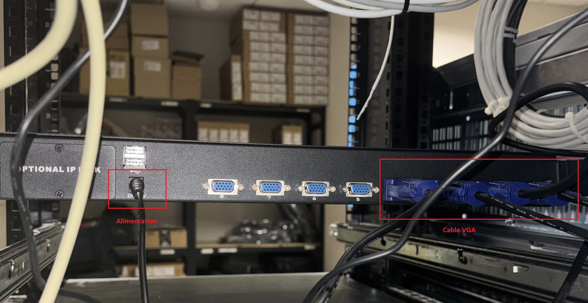
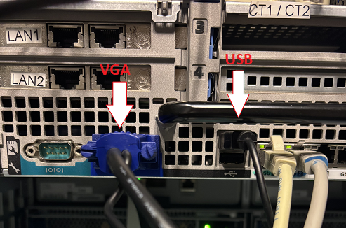
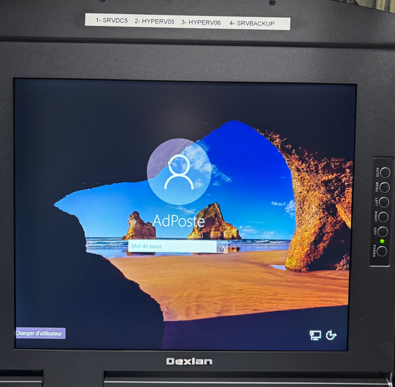
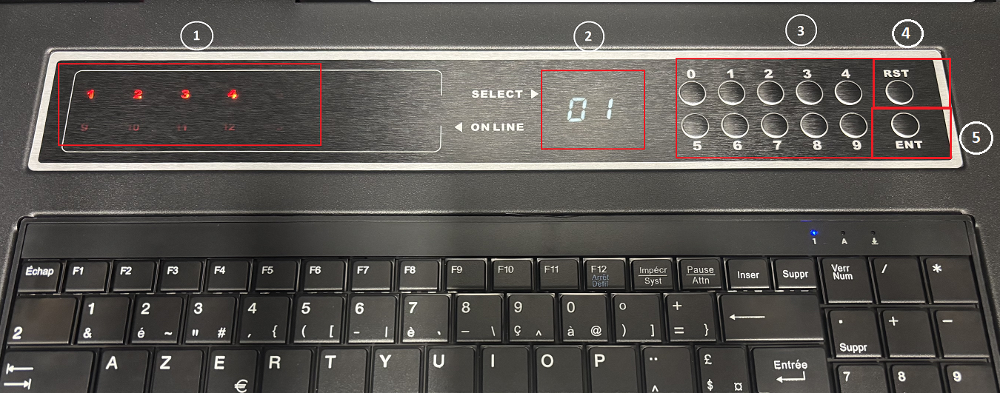

# 🖥️ Procédure d'installation — Console KVM Dexlan

Procédure pas à pas pour l'installation et la mise en service de la console KVM rackable dans la baie informatique de la mairie.

> ℹ️ Pour le contexte du projet, les objectifs et le matériel utilisé, voir [`README.md`](./README.md).

---

## 📋 Sommaire

4. [Étape 1 — Fixation des rails](#étape-1--fixation-des-rails)
5. [Étape 2 — Installation du KVM sur rails télescopiques](#étape-2--installation-du-kvm-sur-rails-télescopiques)
6. [Étape 3 — Câblage entre le KVM et les serveurs](#étape-3--câblage-entre-le-kvm-et-les-serveurs)
7. [Étape 4 — Tests et mise en service](#étape-4--tests-et-mise-en-service)
8. [Interface de contrôle](#interface-de-contrôle)

---

## Étape 1 — Fixation des rails

### 🎯 Objectif
Fixer les deux rails de support (format rackmount 19") pour accueillir la console KVM.

### 📍 Positionnement
* **Emplacement :** Niveau **26U** de la baie principale.
* **Méthode :** Vissage direct sur les montants verticaux avant et arrière de la baie.
 

 

> [!NOTE]
> *Le niveau **26U** a été spécifiquement choisi car il est **à hauteur d'homme**.*

### ⚡ Optimisation du câblage
Le choix de cet emplacement permet une **proximité immédiate avec les serveurs** (distance < 2 m).
Cette configuration est stratégique car elle :
* Réduit la longueur des câbles KVM (VGA/USB).
* Limite l'encombrement à l'arrière de la baie.
* Assure une meilleure clarté pour l'identification des ports.

---

## Étape 2 — Installation du KVM sur rails télescopiques

### ⚙️ Principe de fonctionnement
Le châssis KVM est monté sur des rails coulissants permettant deux positions de travail :

* **🔓 Position Ouverte (Tiré) :** Accès immédiat à l'écran LED, au clavier AZERTY et au touchpad pour l'administration.
* **🔒 Position Fermée (Replié) :** Le tiroir se replie dans le rack.

---

## Étape 3 — Câblage entre le KVM et les serveurs

### 🖥️ Côté KVM (Arrière du switch)
Les ports VGA sont numérotés de 1 à 8 pour ce modèle.

| Connecteur | Rôle & Description |
| :--- | :--- |
| **🔌 Alimentation** | Cordon secteur standard pour l'unité centrale du KVM. |
| **📺 Port VGA (Console)** | Reçoit le flux vidéo combiné des serveurs cibles. |

 

 

### 💽 Côté Serveur
Chaque serveur est relié via un câble pieuvre unique qui se divise en deux à l'extrémité :

| Connecteur | Fonction technique |
| :--- | :--- |
| **🔵 VGA** | Relie la sortie vidéo du serveur au KVM pour l'affichage déporté. |
| **⌨️ USB** | Émulation clavier/souris : le serveur détecte les périphériques comme s'ils étaient branchés en local. |

 

 

---

## Étape 4 — Tests et mise en service

Une fois les serveurs branchés, allumage de l'écran KVM pour contrôle :
- ✅ Affichage correct de l'interface graphique
- ✅ Réponse clavier/souris opérationnelle
- ✅ Passage entre les différents serveurs fonctionnel

 

> [!NOTE]
> *Une fois le serveur sélectionné, son affichage apparaît à l'écran. L'interface Windows s'affiche alors comme sur un PC classique : il suffit de taper les identifiants pour ouvrir la session.*

---

## Interface de contrôle

### 🕹️ Panneau de commande frontal
 

 

| N° | Élément | Fonction détaillée |
| :---: | :--- | :--- |
| **1** | **Indicateurs LED** | LED allumées = Serveurs détectés. |
| **2** | **Afficheur Digital** | Affiche en temps réel le numéro du port (serveur) contrôlé. |
| **3** | **Sélecteurs (1-8)** | Touches physiques pour basculer instantanément d'un serveur à l'autre. |
| **4** | **Reset** | Réinitialise le KVM (clavier/souris) sans impacter les serveurs. |
| **5** | **ENT** | Défilement automatique des serveurs actifs. |
