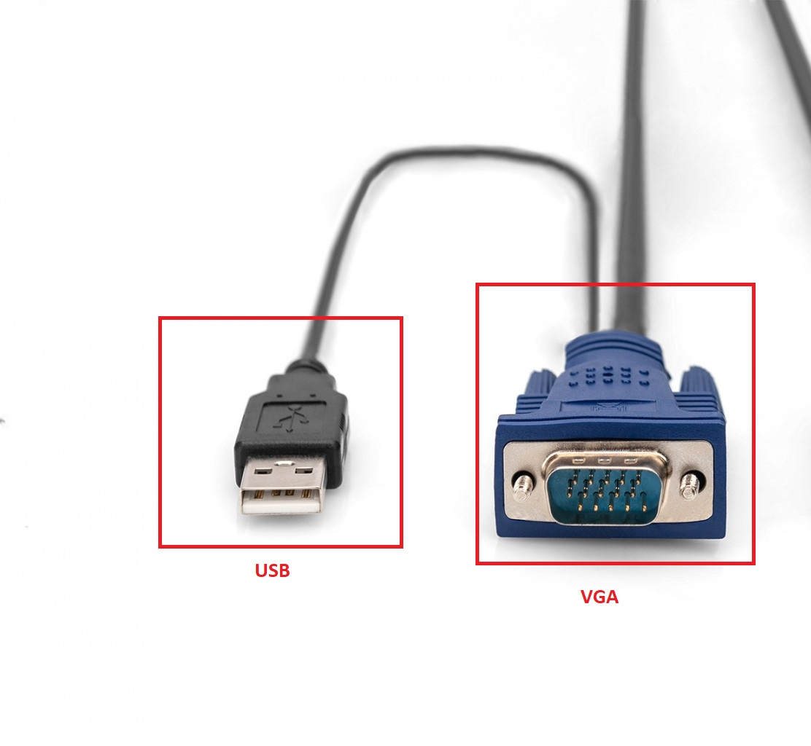

# 🖥️ Projet d'installation d'un KVM

Documentation technique — Installation et configuration d'une console KVM rackable (Dexlan) dans une baie informatique de mairie.

---

## 📋 Table des matières

1. [Qu'est-ce qu'un KVM ?](#quest-ce-quun-kvm-)
2. [Pourquoi un KVM en mairie ?](#pourquoi-un-kvm-en-mairie-)
3. [Matériel utilisé](#matériel-utilisé)

> ℹ️ La procédure d'installation détaillée (fixation des rails, câblage, tests, interface de contrôle) se trouve dans [`PROCEDURE.md`](./PROCEDURE.md).

---

## Qu'est-ce qu'un KVM ?

> **Définition :** Un **KVM** (*Keyboard, Video, Mouse*) est un commutateur matériel permettant de contrôler plusieurs ordinateurs ou serveurs avec un seul clavier, un seul écran et une seule souris.

### 📸 Aperçu de l'installation en mairie

 

> [!NOTE]
> *La console KVM Dexlan déployée dans la baie informatique de la mairie, permettant l'accès direct aux serveurs.*

## 🎯 Contexte et Objectifs du projet

### 📜 État des lieux (Contexte initial)
Avant l'intervention, la mairie utilisait un commutateur KVM compact rudimentaire (sans interface intégrée).

Cette configuration imposait des contraintes lourdes :
* **Logistique contraignante :** Déplacement systématique d'une console mobile (écran/clavier/souris) en salle serveur.
* **Perte de réactivité :** Temps de préparation avant intervention trop long en cas d'urgence.

### ❓ Problématique
> **Comment moderniser et sécuriser l'accès aux serveurs tout en réduisant les manipulations physiques et les risques d'interruption de service ?**

### 🚀 Objectifs
L'installation de la console rackable Dexlan vise principalement à :

1. **Centralisation :** Regrouper l'administration des 8 ports sur une interface unique "tout-en-un" (Écran/Clavier/Touchpad).
2. **Réactivité :** Supprimer les délais de mise en place du matériel lors des maintenances.
3. **Sécurisation :** Limiter l'usure des connecteurs serveurs en fixant durablement le câblage (câbles pieuvres).
4. **Ergonomie :** Optimiser l'espace dans la baie et améliorer le confort de travail du technicien (travail à hauteur d'homme).

---

### 📥 Schéma de fonctionnement

 

### 🔍 Zoom sur le matériel : Plus qu'un simple boîtier

Le schéma ci-dessus illustre la centralisation de l'infrastructure. Il est important de préciser que le **KVM** utilisé n'est pas un simple commutateur externe, mais une **console rackable complète**.

| Élément | Description technique |
| :--- | :--- |
| **Les Serveurs (Cibles)** | Machines hôtes (Serveur 1, 2, 3) administrées. Ils reçoivent les commandes comme s'ils possédaient leur propre console dédiée. |
| **Le KVM Switch (Cœur)** | L'intelligence du système. Il centralise les câbles "Combo" de chaque serveur et assure l'aiguillage instantané du flux vidéo et des commandes. |
| **La Console (Interface)** | Le tiroir coulissant qui intègre physiquement l'**écran LCD**, le **clavier** et le **touchpad** reliés au switch. |
| **La Connectique** | Utilise des **câbles pieuvres** (VGA + USB vers un connecteur unique) pour optimiser le flux d'air et le rangement dans la baie. |

---

#### 🛠️ Fonctionnement du système
Contrairement à une installation classique, cette solution "tout-en-un" permet :
* **De réduire l'encombrement dans la baie** : Un seul écran/clavier au lieu de plusieurs consoles séparées.
* **Une gestion physique directe** : Accès au BIOS et aux OS même en cas de panne réseau (contrairement à une prise en main à distance type RDP/VNC).
* **Une commutation rapide** : Passage du **Serveur 1** au **Serveur 3** via les boutons en façade ou un raccourci clavier.

---

#### 🌐 Note sur la prise en main à distance (KVM over IP)
Il est important de noter que ce modèle est une **console locale**. Pour obtenir une prise en main à distance équivalente (accès BIOS à distance), l'ajout d'un **module IP** serait nécessaire pour les raisons suivantes :
* **Accès distant via Internet/LAN** : Permet d'administrer les serveurs sans se déplacer physiquement en mairie.
* **Indépendance de l'OS** : Contrairement à TeamViewer ou RDP, le KVM IP permet de voir le démarrage du serveur (POST) à distance.
* **Sécurité accrue** : Chiffrement des flux vidéo et clavier/souris hors du système d'exploitation hôte.

> [!IMPORTANT]
> **Ce qu'il faut retenir :**
> En l'état, cette console est l'unique point d'entrée physique pour administrer l'ensemble des serveurs. Elle améliore la sécurité (aucune exposition réseau du flux KVM) et contribue à réduire l'encombrement dans la baie.

---

## Pourquoi un KVM en mairie ?

L'installation d'une console KVM au sein d'une collectivité répond à des enjeux de réactivité et de sécurité des données des administrés.

| Avantage | Description |
| :--- | :--- |
| **⏱️ Gain de temps** | Bascule instantanée entre les différents serveurs sans aucun rebranchement manuel. |
| **💰 Économie** | Un seul ensemble écran/clavier remplace l'achat de plusieurs consoles dédiées. |
| **🔒 Sécurité** | Accès physique centralisé et réduit en salle serveur. En limitant les manipulations de câbles, on renforce la conformité **RGPD** et la stabilité du matériel. |
| **🧰 Ergonomie** | Intervention immédiate en cas de panne : le technicien agit directement sur place sans matériel supplémentaire (clavier/écran mobile). |

---

### 🏛️ Impact sur le service
_Cette solution optimise la gestion informatique de la collectivité tout en limitant les interruptions de service public. En cas de crash système, le temps de diagnostic est divisé par deux grâce à l'accès direct au BIOS, garantissant une remise en ligne rapide._

---

## Matériel utilisé

### Console KVM Rackable — Dexlan

| Caractéristique | Détail |
| :--- | :--- |
| **Format** | Rack 1U — baie 17 pouces |
| **Écran** | LCD 19 pouces |
| **Clavier** | AZERTY complet + pavé tactile (touchpad) |
| **Ports serveurs** | 8 ports |
| **Résolution** | Jusqu'à 1280×1024 @ 60 Hz |
| **Compatibilité OS** | Windows Server, Linux/Debian, ESXi (indépendant de l'OS) |
| **Châssis** | Coulissant sur rails télescopiques |

---

### 🔌 Câblage spécifique Dexlan
Dexlan utilise des **câbles "pieuvre"** qui regroupent les signaux vidéo (VGA) et les données (USB/PS2) en un seul connecteur côté KVM.
 
 

> [!NOTE]
> _Cela permet de limiter le câblage "spaghetti" à l'arrière de la baie._

---

### 🖥️ Modes de commutation disponibles

* **Boutons physiques** en façade
* **Raccourcis clavier** (Hotkeys)
* **Menu à l'écran** (OSD — On Screen Display)
